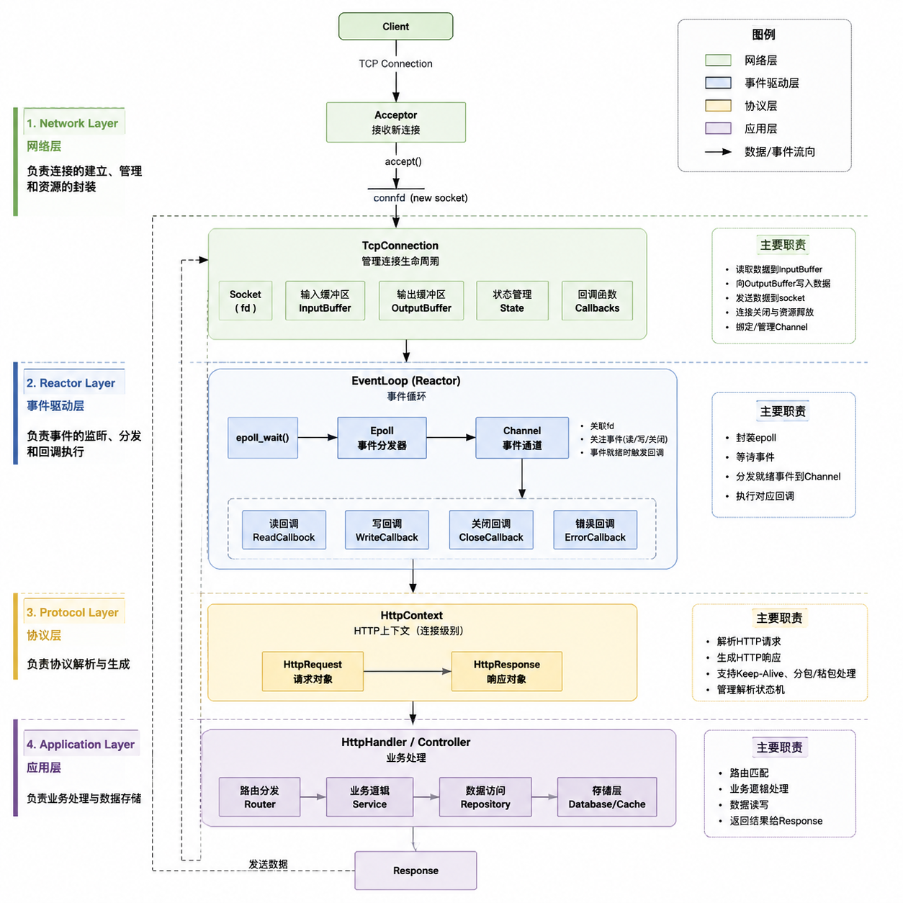

# Chihiro-WebServer
基于 Linux 平台实现的 C++ 高性能网络服务器学习项目。

本项目从底层 Socket 编程开始，逐步实现基于 **Reactor 模型** 的网络服务器框架，主要用于深入学习 Linux 网络编程、I/O 多路复用、事件驱动架构以及 C++ 工程设计。
项目目前支持基于 epoll 的事件分发、TCP 连接管理、定时器管理以及协议层扩展，整体采用模块化设计，方便后续扩展 HTTP、Redis、自定义协议等功能。

---

## Features

目前已实现：

* Linux Socket 网络通信
* 非阻塞 I/O
* epoll I/O 多路复用
* Reactor 事件循环模型
* Channel 事件封装
* TCP 连接生命周期管理
* Buffer 缓冲区设计
* Timer 定时器系统
* TCP 空闲超时自动回收
* ProtocolHandler 协议抽象
* HTTP / Echo 等协议模块扩展接口
---

## Architecture


## Module Description
### Base Layer

负责基础组件：

```
base
├── EventLoop
├── Epoll
├── Channel
├── Timer
└── Buffer
```
### EventLoop

核心事件循环：
负责：

* 等待 IO 事件
* 分发 Channel 回调
* 调度 Timer 事件

基本流程：
while(true)

    |
    v
epoll_wait()

    |
    v
Channel::handleEvents()

    |
    v
TimerQueue::handleExpired()


### Epoll

封装 Linux epoll：
支持：
* epoll_create
* epoll_ctl
* epoll_wait
负责管理文件描述符事件注册和事件返回。
---

### Channel

对 fd 和事件进行封装。
一个 Channel 对应一个 IO 资源。
负责：

* 监听事件类型
* 保存回调函数
* 分发 Read / Write / Close / Error 事件

---

### Network Layer
net
├── Socket
├── Acceptor
└── TcpConnection


---
### TcpConnection
负责单个 TCP 连接生命周期：

包括：

* socket 管理
* 读写缓冲区
* 数据收发
* 连接关闭
* 超时检测

连接生命周期：
        accept
            |
            v
        TcpConnection create
            |
            v
        EventLoop register
            |
            v
        handle events
            |
            v
        timeout / close
            |
            v
        resource release


---
### Timer System
Timer 基于小根堆实现：
        TimerQueue

             |
             v

        Min Heap

             |
             v

    nearest expire timer

EventLoop 根据最近到期时间调整 epoll 等待时间：
Timer exists:
epoll_wait(timeout)
No Timer:
epoll_wait(-1)

支持：
* 延迟任务执行
* TCP 空闲连接超时回收

---

## Protocol Design
协议层采用接口抽象：
ProtocolHandler
分层实现Echo Http Redis协议解析设计
---

## Connection Timeout Example
TCP 建立连接后注册 Timer：
Client Connect
    |
    v
TcpConnection

    |
    v
TimerQueue

    |
    v
Timeout
    |
    v
close connection

---

## Build

Requirements:
* Linux
* C++17
* CMake >= 3.10

Build:

bash
mkdir build
cd build
cmake ..
make

Run:

```bash
./WebServer
```

---
## Future Plan

后续计划：

* [ ] 完善 HTTP 协议
* [ ] Keep-Alive 长连接支持
* [ ] Timer cancel / reset
* [ ] EventLoopThreadPool 多线程模型
* [ ] Reactor 多线程架构
* [ ] 压力测试与性能优化
* [ ] 日志系统完善
* [ ] 内存池优化
---

## Learning Purpose

本项目主要用于深入理解：
* Linux 网络编程
* TCP/IP
* I/O 多路复用
* Reactor设计模式
* C++ RAII
* 智能指针生命周期管理
* 高并发服务器架构设计
## Author
Chihiro
